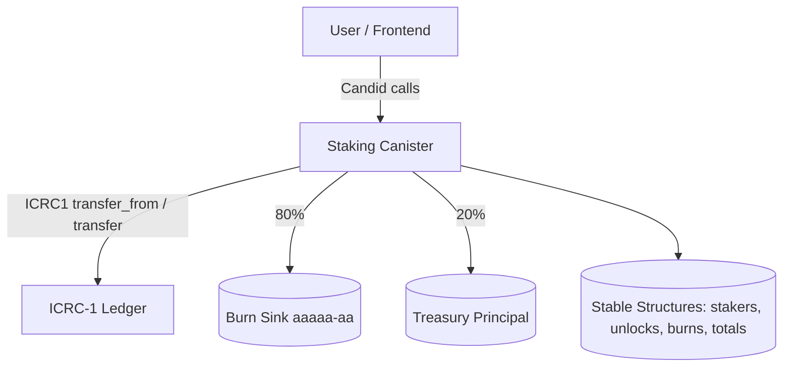
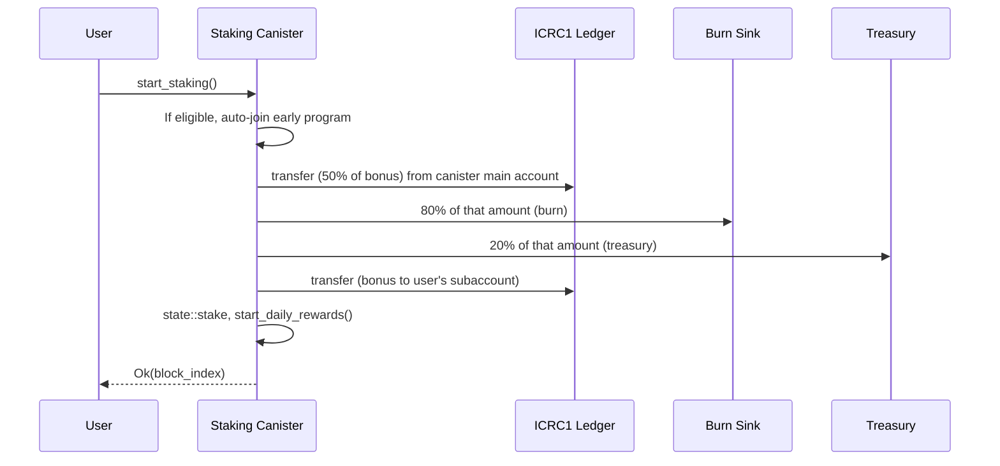
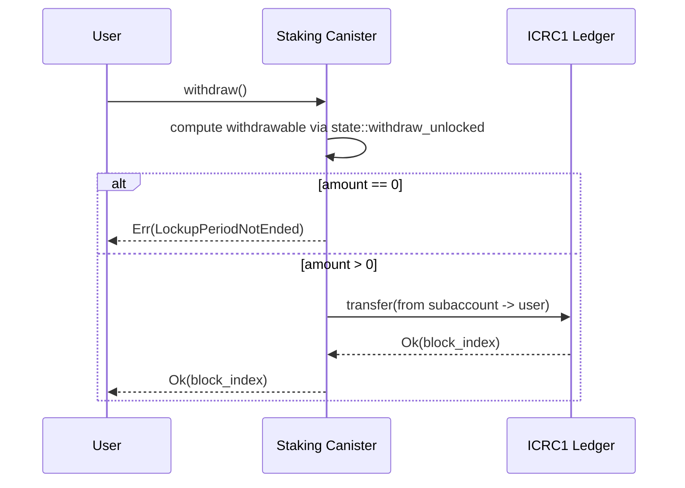

# Backend Architecture (Plebes Staking Canister)

This document describes the architecture of the staking backend canister, its components, persistent state, and interactions with external systems.

## High-level Components

- Staking Canister (this backend)
  - Exposes staking and early-staking program endpoints
  - Maintains user staking state and protocol metrics in stable memory
  - Manages timed daily reward distribution
  - Executes token transfers via ICRC-1 ledger canister
  - Implements a burn mechanism (80% burned, 20% to treasury)
- ICRC-1 Ledger Canister (external)
  - Holds PLBS token balances
  - Used for transfer and transfer_from operations
- Burn Sink Principal (aaaaa-aa)
  - Black-hole address that irreversibly removes tokens
- Treasury Principal
  - Receives the treasury portion of burn splits
- Stable Storage (state module)
  - Stakers, transactions, unlock events, burn events
  - Protocol-wide counters (totals)
  - Early staking participants and counters
  - Anti-fragmentation attempt tracking

## Visual Overview



## Key Flows

### Start Staking (Early Staking Program)



### Stake (Manual)

```mermaid
sequenceDiagram
  participant U as User
  participant S as Staking Canister
  participant L as ICRC1 Ledger

  U->>S: stake(amount)
  S->>L: transfer_from(user -> canister subaccount)
  L-->>S: Ok(block_index)
  S->>S: state::stake; start_daily_rewards()
  S-->>U: Ok(block_index)
```

### Withdraw



### Burn Tokens (ULTRA-MVP)

```mermaid
sequenceDiagram
  participant U as User
  participant S as Staking Canister
  participant L as ICRC1 Ledger
  participant B as Burn Sink
  participant T as Treasury

  U->>S: burn_tokens(amount)
  S->>S: Anti-fragmentation checks (limits, lockout)
  S->>L: transfer (80% -> Burn Sink)
  S->>L: transfer (20% -> Treasury)
  S->>S: Reduce active_stake; log event; update totals
  S-->>U: BurnResult { burned, to_treasury }
```

## Data Model (Stable State)

Maintained in the `state` module using stable structures:
- Stakers: Principal -> StakerData
  - active_stake (Nat), last_stake_time (u64)
- Transactions: Principal -> Vec<Nat> (reward history)
- Unlock Events: Principal -> Vec<UnlockEvent>
  - amount (Nat), unlock_time (u64), created_at (u64), tx_index (Nat)
- Burn Events: Principal -> Vec<BurnEvent>
- Attempts: Principal -> Attempts (anti-fragmentation)
- Protocol Counters (Nat): TOTAL_STAKED, TOTAL_LOCKED, TOTAL_REWARDS_DISTRIBUTED, TOTAL_BURNED, TOTAL_TO_TREASURY
- Early Staking: participants set, EARLY_STAKING_COUNT

Lockup period: 30 days (nanoseconds). Reward rate: legacy per-stake 1 token/day; early-staking participants receive flat 1 PLBS/day in e8s.

## Timers and Upgrades

- Daily Rewards: `set_timer` schedules 24-hour reward distribution per active staker.
- Post Upgrade: `post_upgrade` restarts timers for all active stakers to continue rewards.

## Public Interface (Selected)

From the Candid interface:
- Staking
  - set_token_canister(principal)
  - get_token_canister() -> principal (query)
  - stake(nat) -> Result_2
  - start_staking() -> Result_2
  - withdraw() -> Result_2
  - my_staking_balance() -> Result_1 (query)
  - staking_balance(principal) -> Result_1 (query)
  - subaccount_balance(principal) -> Result_2
  - user_subaccountQ(principal) -> blob (query)
  - get_protocol_stats() -> ProtocolStats (query)
- Early Staking
  - join_early_staking_program() -> variant { Ok : text; Err : text }
  - get_early_staking_info(principal) -> EarlyStakingInfo (query)
  - my_early_staking_info() -> EarlyStakingInfo (query)
  - get_early_staking_stats() -> nat64 (query)
- Burn (ULTRA-MVP)
  - burn_tokens(nat) -> BurnResult
  - get_burn_stats() -> BurnStats (query)
  - get_user_burn_history(principal) -> [BurnEvent] (query)
  - get_attempt_status(principal) -> Attempts (query)
- Demo Mode
  - set_demo_burn_mode(bool)
  - get_demo_burn_mode() -> bool (query)

Error model includes: InvalidAmount, AlreadyStaking, NotStaking, LockupPeriodNotEnded, TransferError/TransferFailed, InsufficientBalance, CanisterCallFailed, and burn-specific AttemptLimit/LockedOut.

## Addresses and Constants

- Burn Sink: `aaaaa-aa`
- Treasury: `4pirv-cmyye-wxchr-37dkz-r6b7o-2gcnk-jf7qn-skfek-46kz4-faldj-uae`
- Token decimals: 8 (e8s)
- Early Staking Program
  - MAX_PARTICIPANTS: 100
  - BONUS: 10 PLBS (in e8s)
  - DAILY_REWARD: 1 PLBS/day
  - LIFETIME_BONUS_PERCENT: 1%

## Notes

- The frontend has removed the "Compound" button, but the canister still exposes `compound_rewards()`; consumers should prefer passive accrual + withdraw after lockup.
- Admin endpoints exist for state reset and subaccount maintenance; protect these behind controller/admin checks in production.

